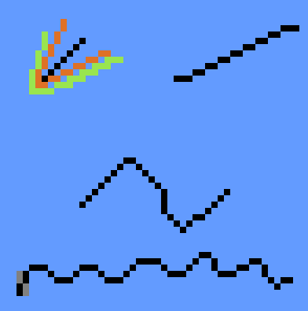
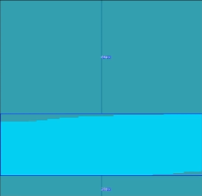
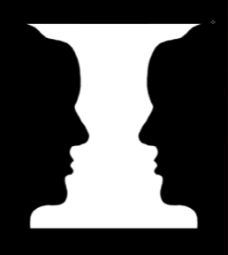
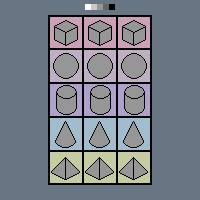
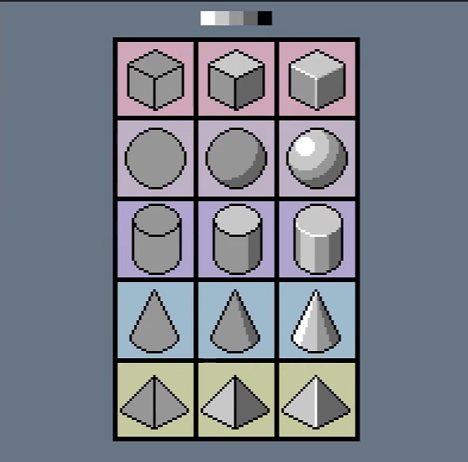

# pixel 技法记录

## 完美像素

指的沿着行进方向，只有一条pixel

对于像素之间的差异不应该过大

可以使用3 2 2 3 这样子

## 对比度区分前景后景
<table>
  <tr>
    <td></td>
    <td></td>
  </tr>
</table>

Value and constrast basics
>前后也不应该对比度太强

## 要突出重点部分

Negative and positive space
负空间 与 正空间
人的视觉是各种各样的，所以要突出一部分，让他着重表现

## 5种基本型状
世界中的物体由五种形状组成，阴影灯光使得它3D
<table>
  <tr>
    <td></td>
    <td></td>
  </tr>
</table>

> 最两边的颜色对应的是高光与阴影，所以只有在高光以及纯阴影部分使用，平常的物体使用的颜色应该是居中一些